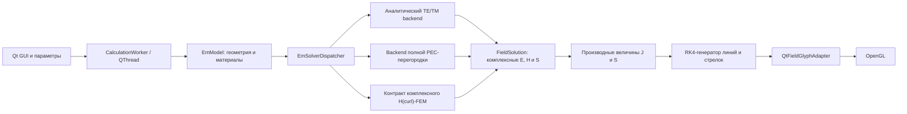

# Математика и архитектура EM-модели прямоугольного волновода

Этот документ описывает именно текущую реализацию проекта. Формулы записаны в формате LaTeX, совместимом с Obsidian.

## 1. Статус физических моделей

| Геометрия | Backend | Статус |
|---|---|---|
| Однородный прямоугольный PEC-волновод | аналитические TE/TM-моды | реализовано и проверено |
| Полная поперечная PEC-перегородка | падающая и отраженная TE/TM-мода | реализовано и проверено |
| Щель при явном режиме фонового поля | невозмущенное поле пустого волновода и оценка связи | реализовано как аппроксимация, не как расчет рассеяния |
| Щель в строгом режиме | комплексный трехмерный H(curl)-FEM + PML | реализован MFEM backend |
| Частичная PEC-пластина | комплексный трехмерный H(curl)-FEM | реализован MFEM backend |
| Объёмный диэлектрический блок | комплексный трехмерный H(curl)-FEM | реализован MFEM backend |
| Частичная, повернутая или произвольная PEC-пластина | H(curl)-FEM или специализированное согласование мод | аналитикой пустого волновода не подменяется |

Главное ограничение: текущая аналитика не утверждает, что рассчитывает поле из щели или около произвольной вставки. Для неподдерживаемой геометрии `EmSolverDispatcher` возвращает требование FEM, а не рисует выдуманное поле.

## 1.1 FEM простыми словами

### Что такое FEM

FEM (`Finite Element Method`, метод конечных элементов) нужен, когда внутри волновода появляется объект, для которого нет одной короткой формулы: частичная металлическая пластина, диэлектрический брусок, отверстие, щель или несколько материалов.

Идея такая:

1. внутренний объем воздуха и диэлектриков разбивается на много маленьких тетраэдров;
2. в каждом тетраэдре поле $E$ представляется через небольшое число неизвестных коэффициентов;
3. коэффициенты соседних тетраэдров связываются уравнениями Максвелла;
4. на стенках задается PEC-условие $\hat n\times E=0$;
5. на входе задается возбуждающая мода, а на выходе — порт для уходящей волны;
6. из большой комплексной системы вычисляются $E$, затем $H$, токи $J_s$, мощность $S$ и S-параметры.

В символах после построения сетки получается система

$$
\mathbf A\mathbf e=\mathbf b.
$$

Вектор $\mathbf e$ — неизвестные коэффициенты электрического поля на ребрах сетки. Матрица $\mathbf A$ содержит геометрию, материалы, частоту, внутренние PEC-поверхности и порты. Для электродинамики применяются реберные элементы Неделека: они правильно сохраняют касательную компоненту $E$ между тетраэдрами.

Точность FEM определяется не одной формулой, а сходимостью: сетку сгущают около кромок, щелей и тонких пластин, затем сравнивают $S_{11}$, $S_{21}$ и баланс мощности между двумя последними сетками.

### Что уже сделано в программе

Сейчас есть два реальных solver-а:

- пустой однородный прямоугольный волновод: точные аналитические TE/TM-формулы;
- одна сплошная PEC-пластина поперек всего сечения: точная сумма падающей и отраженной моды, то есть короткое замыкание.

Для них программа действительно вычисляет комплексные $E$, $H$, $J_s$, $S$ и S-параметры.

### Что пока не сделано

В файлах `em/fem_frequency_domain_solver.*` находится только контракт будущего FEM backend-а. Там пока нет:

- построения тетраэдральной сетки;
- элементов Неделека;
- сборки матрицы $\mathbf A$;
- решения $\mathbf A\mathbf e=\mathbf b$;
- PML для наружного поля щели.

То есть частичная пластина, отверстие, произвольный диэлектрический блок и точное поле щели пока не рассчитываются. Программа явно сообщает, что для них нужен FEM, вместо того чтобы применять неверную формулу пустого волновода.

### Как FEM обрабатывает внутренние объекты

| Внутренний объект | Что попадает в FEM-модель |
|---|---|
| Сплошная PEC-пластина | внутренняя поверхность с условием $\hat n\times E=0$ |
| Частичная PEC-перегородка | ее поверхность, кромки и окружающий объем воздуха |
| Диэлектрический блок | тетраэдры блока получают свою $\varepsilon_r$ и $\sigma$ |
| Щель | воздух в апертуре, металл вокруг кромки и внешний воздушный объем с PML |

## 1.2 Что изменено в этом проекте

Раньше GUI и отрисовка сами строили приблизительные линии полей. Теперь расчет разделен:

$$
\text{геометрия и материал}
\rightarrow
\text{solver}
\rightarrow
E,H,J,S
\rightarrow
\text{линии и стрелки}
\rightarrow
\text{OpenGL}.
$$

Это важно: OpenGL больше не придумывает физику. Он получает уже рассчитанные векторы и только показывает их. Для TE$_{10}$ отдельная визуализация строит эпюры $|E_y|\propto\sin(\pi x/a)$, чтобы пучность по центру была заметна.

## 2. Архитектура

Границы модулей:

- `em/` не зависит от Qt и OpenGL;
- `postprocessing/field_visualization_generator.*` получает только `FieldSolution`;
- `postprocessing/qt_field_glyph_adapter.*` является единственной Qt-границей постобработки;
- `waveguide_opengl_widget.*` не вычисляет электродинамику, а только выводит готовые примитивы;
- `CalculationWorker` запускает solver и постобработку вне GUI-потока и поддерживает кооперативную отмену.

Основные файлы:

| Файл | Ответственность |
|---|---|
| `em/em_model.h` | геометрия, материал, возбуждение и настройки |
| `em/em_solver.h` | общий интерфейс solver-а и токен отмены |
| `em/em_solver_dispatcher.*` | строгий выбор подходящего backend-а |
| `em/rectangular_mode_field.*` | единая формула падающей и отраженной TE/TM-моды |
| `em/rectangular_waveguide_solver.*` | моды и S-параметры пустого волновода |
| `em/transverse_pec_partition_solver.*` | полная поперечная PEC-перегородка |
| `em/fem_frequency_domain_solver.*` | точка подключения внешнего H(curl)-FEM backend-а |
| `em/em_solution.h` | комплексные E/H, моды, S и диагностика мощности |
| `em/derived_fields.h` | $J_s$, ток проводимости, ток смещения и S |
| `postprocessing/field_visualization_generator.*` | RK4-линии и амплитудное прореживание |
| `postprocessing/qt_field_glyph_adapter.*` | перевод SI-геометрии в Qt glyph-ы |
| `tests/em_core_tests.cpp` | независимые физические и архитектурные проверки |

## 3. Координаты, единицы и фазоры

В расчетном ядре используются только единицы SI:

- длина: метр;
- частота: герц;
- электрическое поле: В/м;
- магнитное поле: А/м;
- поверхностная плотность тока: А/м;
- мощность: Вт.

Внутреннее сечение волновода:

$$
-\frac a2\le x\le \frac a2,
\qquad
-\frac b2\le y\le \frac b2,
\qquad
-\frac L2\le z\le \frac L2.
$$

Ось распространения направлена вдоль $+z$. Для формул удобно ввести

$$
x'=x+\frac a2,
\qquad
y'=y+\frac b2,
\qquad
z'=z+\frac L2.
$$

Принята временная зависимость

$$
\mathbf E(\mathbf r,t)=\operatorname{Re}
\left\{\widetilde{\mathbf E}(\mathbf r)e^{j\omega t}\right\},
\qquad
\mathbf H(\mathbf r,t)=\operatorname{Re}
\left\{\widetilde{\mathbf H}(\mathbf r)e^{j\omega t}\right\}.
$$

Бегущая в направлении $+z$ волна имеет множитель

$$
e^{-\gamma z'},
\qquad
\gamma=\alpha+j\beta.
$$

Для идеального диэлектрика выше отсечки $\alpha=0$ и $\gamma=j\beta$.

## 4. Уравнения Максвелла

Для выбранного соглашения $e^{j\omega t}$:

$$
\nabla\times\widetilde{\mathbf E}
=-j\omega\mu\widetilde{\mathbf H},
$$

$$
\nabla\times\widetilde{\mathbf H}
=\left(\sigma+j\omega\varepsilon\right)
\widetilde{\mathbf E}
=j\omega\varepsilon_c\widetilde{\mathbf E},
$$

где комплексная диэлектрическая проницаемость равна

$$
\varepsilon_c=\varepsilon_0\varepsilon_r-j\frac{\sigma}{\omega},
\qquad
\mu=\mu_0\mu_r.
$$

В однородной области:

$$
\nabla\cdot(\varepsilon_c\widetilde{\mathbf E})=0,
\qquad
\nabla\cdot(\mu\widetilde{\mathbf H})=0.
$$

Комплексное волновое число среды:

$$
k^2=\omega^2\mu\varepsilon_c.
$$

## 5. Индексы мод и отсечка

Для моды $(m,n)$:

$$
k_x=\frac{m\pi}{a},
\qquad
k_y=\frac{n\pi}{b},
\qquad
k_c^2=k_x^2+k_y^2.
$$

Постоянная распространения вычисляется как

$$
\gamma=\sqrt{k_c^2-k^2}.
$$

В коде выбирается пассивная ветвь корня:

$$
\operatorname{Re}\gamma\ge 0,
\qquad
\operatorname{Im}\gamma\ge 0.
$$

Для среды без потерь:

$$
f_{c,mn}=\frac{v}{2}
\sqrt{\left(\frac ma\right)^2+
      \left(\frac nb\right)^2},
\qquad
v=\frac{1}{\sqrt{\mu\varepsilon}}.
$$

TE-мода допустима, если $(m,n)\ne(0,0)$. Для TM-моды обязательно $m>0$ и $n>0$. Моды TE$_{00}$ и TM$_{m0}$/TM$_{0n}$ не существуют.

## 6. Общий продольный множитель

Для суммы падающей и отраженной волн используется

$$
F(z)=A^+e^{-\gamma z'}+A^-e^{+\gamma z'},
$$

$$
F'(z)=\gamma
\left(A^-e^{+\gamma z'}-A^+e^{-\gamma z'}\right).
$$

В пустом однородном волноводе $A^-=0$. Для короткозамкнутой перегородки $A^-$ определяется граничным условием на PEC.

## 7. TE-моды

Для TE-моды $E_z=0$, а продольная компонента магнитного поля задается как

$$
H_z=F(z)\cos(k_xx')\cos(k_yy').
$$

Компоненты получаются непосредственно из уравнений Максвелла:

$$
E_x=-\frac{j\omega\mu}{k_c^2}
\frac{\partial H_z}{\partial y},
\qquad
E_y=\frac{j\omega\mu}{k_c^2}
\frac{\partial H_z}{\partial x},
\qquad
E_z=0,
$$

$$
H_x=\frac{1}{k_c^2}
\frac{\partial^2 H_z}{\partial x\,\partial z},
\qquad
H_y=\frac{1}{k_c^2}
\frac{\partial^2 H_z}{\partial y\,\partial z}.
$$

В развернутом виде:

$$
E_x=
\frac{j\omega\mu k_y}{k_c^2}
F(z)\cos(k_xx')\sin(k_yy'),
$$

$$
E_y=
-\frac{j\omega\mu k_x}{k_c^2}
F(z)\sin(k_xx')\cos(k_yy'),
$$

$$
H_x=
-\frac{k_x}{k_c^2}
F'(z)\sin(k_xx')\cos(k_yy'),
$$

$$
H_y=
-\frac{k_y}{k_c^2}
F'(z)\cos(k_xx')\sin(k_yy'),
$$

$$
H_z=F(z)\cos(k_xx')\cos(k_yy').
$$

### TE10

Для доминирующей моды TE$_{10}$:

$$
k_x=\frac\pi a,
\qquad
k_y=0,
\qquad
k_c=\frac\pi a.
$$

Ненулевые компоненты:

$$
E_y=-j\frac{\omega\mu}{k_x}
F(z)\sin(k_xx'),
$$

$$
H_x=-\frac{1}{k_x}
F'(z)\sin(k_xx'),
$$

$$
H_z=F(z)\cos(k_xx').
$$

Следовательно, в пустом волноводе TE$_{10}$ электрическое поле направлено поперек узкой стороны, а магнитное поле имеет поперечную и продольную составляющие. Это не набор независимых окружностей: обе структуры связаны уравнениями Максвелла и общей фазой.

## 8. TM-моды

Для TM-моды $H_z=0$, а

$$
E_z=F(z)\sin(k_xx')\sin(k_yy').
$$

Поперечные компоненты:

$$
E_x=\frac{1}{k_c^2}
\frac{\partial^2 E_z}{\partial x\,\partial z},
\qquad
E_y=\frac{1}{k_c^2}
\frac{\partial^2 E_z}{\partial y\,\partial z},
$$

$$
H_x=\frac{j\omega\varepsilon_c}{k_c^2}
\frac{\partial E_z}{\partial y},
\qquad
H_y=-\frac{j\omega\varepsilon_c}{k_c^2}
\frac{\partial E_z}{\partial x},
\qquad
H_z=0.
$$

В развернутом виде:

$$
E_x=\frac{k_x}{k_c^2}
F'(z)\cos(k_xx')\sin(k_yy'),
$$

$$
E_y=\frac{k_y}{k_c^2}
F'(z)\sin(k_xx')\cos(k_yy'),
$$

$$
E_z=F(z)\sin(k_xx')\sin(k_yy'),
$$

$$
H_x=\frac{j\omega\varepsilon_c k_y}{k_c^2}
F(z)\sin(k_xx')\cos(k_yy'),
$$

$$
H_y=-\frac{j\omega\varepsilon_c k_x}{k_c^2}
F(z)\cos(k_xx')\sin(k_yy').
$$

## 9. Граничные условия PEC

Для идеального проводника:

$$
\hat{\mathbf n}\times\widetilde{\mathbf E}=0,
$$

$$
\hat{\mathbf n}\cdot\widetilde{\mathbf B}=0.
$$

Здесь $\hat{\mathbf n}$ направлена из металла в область поля.

Поверхностная плотность электрического тока:

$$
\widetilde{\mathbf J}_s=
\hat{\mathbf n}\times\widetilde{\mathbf H},
\qquad [\mathbf J_s]=\text{А/м}.
$$

Поверхностный заряд:

$$
\rho_s=\hat{\mathbf n}\cdot\widetilde{\mathbf D}.
$$

На поверхности выполняется уравнение непрерывности

$$
\nabla_s\cdot\widetilde{\mathbf J}_s
=-j\omega\rho_s.
$$

Поэтому мгновенные линии поверхностного тока не обязаны каждая образовывать отдельную замкнутую окружность: они могут сходиться к области переменного поверхностного заряда, проходить через портовую границу или обрываться на кромке апертуры. Искусственно замыкать их вопреки вычисленному $\mathbf J_s$ нельзя.

Отсюда следует важное правило визуализации:

- касательная компонента $E$ на PEC равна нулю;
- нормальная компонента $E$ может быть ненулевой и заканчивается на поверхностном заряде;
- линии $E$ вообще не обязаны быть замкнутыми;
- магнитные линии не имеют начала или конца из-за $\nabla\cdot\mathbf B=0$, но в конечной расчетной области могут пересекать портовую границу.

Поэтому рисовать электрические линии вдоль металлической стенки физически неверно. В OpenGL у стенки показывается нормальный тонкий отрезок со стрелкой, если нормальная компонента ненулевая.

## 10. Мощность и нормировка

Средний по времени вектор Пойнтинга:

$$
\langle\mathbf S\rangle=
\frac12\operatorname{Re}
\left(\widetilde{\mathbf E}
\times\widetilde{\mathbf H}^{*}\right).
$$

Мощность через поперечное сечение:

$$
P(z)=\iint_A
\langle\mathbf S\rangle\cdot\hat{\mathbf z}\,dA.
$$

Сначала поле рассчитывается с единичной продольной амплитудой. Затем применяется масштаб

$$
C=\sqrt{\frac{P_{\text{target}}}{P_{\text{unit}}}}.
$$

По умолчанию

$$
P_{\text{target}}=1\ \text{Вт}.
$$

Интеграл вычисляется численно по центрам ячеек поперечного сечения. Отдельные тесты повторяют интегрирование на другой сетке.

## 11. S-параметры пустого волновода

Для согласованного однородного участка длины $L$:

$$
S_{11}=S_{22}=0,
$$

$$
S_{21}=S_{12}=e^{-\gamma L}.
$$

Для среды без потерь:

$$
|S_{21}|=1.
$$

При $\alpha>0$:

$$
|S_{21}|=e^{-\alpha L}.
$$

## 12. Полная поперечная PEC-перегородка

Аналитический backend принимает только одну неповернутую PEC-пластину, которая полностью перекрывает внутреннее сечение. Для пластины толщины $t$:

$$
z_f=z_c-\frac t2,
\qquad
z_b=z_c+\frac t2.
$$

$z_f$ является гранью со стороны порта 1, $z_b$ — гранью со стороны порта 2.

Расстояния от опорных плоскостей портов:

$$
d_1=z_f+\frac L2,
\qquad
d_2=\frac L2-z_b.
$$

Коэффициент отражения поперечного электрического поля от короткого замыкания:

$$
S_{11}=-e^{-2\gamma d_1},
\qquad
S_{22}=-e^{-2\gamma d_2}.
$$

Передача через сплошной PEC равна нулю:

$$
S_{21}=S_{12}=0.
$$

Продольные амплитуды отраженной моды различаются для TE и TM.

Для TE касательное поле пропорционально $F(z)$, поэтому условие $E_t(z_f)=0$ требует

$$
A^-_{\mathrm{TE}}=-A^+e^{-2\gamma d_1}.
$$

Для TM касательное поле пропорционально $F'(z)$, поэтому

$$
A^-_{\mathrm{TM}}=+A^+e^{-2\gamma d_1}.
$$

Знак S-параметра в обоих случаях остается отрицательным, потому что S-параметр определяется по поперечной электрической волне, а не по $H_z$ или $E_z$.

При возбуждении только порта 1:

- слева от $z_f$ рассчитывается точная сумма падающей и отраженной мод;
- на $z_f$ выполняется $E_t=0$;
- внутри пластины и справа от нее поле данного возбуждения равно нулю;
- ток на входной грани пластины вычисляется как

$$
\widetilde{\mathbf J}_{s,\text{plate}}=
(-\hat{\mathbf z})\times
\widetilde{\mathbf H}(z_f^-).
$$

Для идеальной среды

$$
P_{\text{reflected}}=P_{\text{incident}},
\qquad
P_{\text{transmitted}}=0.
$$

При потерях в заполнении $|S_{11}|<1$, потому что волна проходит расстояние $2d_1$ до отражения и обратно.

## 13. Щель: что вычисляется сейчас

Щель изменяет граничную задачу. Поле пустого волновода после добавления щели больше не является точным решением всей геометрии.

В приложении допускается явно выбранная аппроксимация невозмущенного фонового поля. В этом режиме:

1. рассчитывается поле соответствующей моды без учета обратного влияния щели;
2. поверхностные линии тока обрываются на апертуре;
3. оценивается локальная способность щели пересекать ток;
4. наружное поле и S-параметры щели не синтезируются.

Пусть $\hat{\mathbf u}$ — поперечная ось стенки, а $\hat{\mathbf z}$ — ось волновода. Для угла щели $\theta$:

$$
\hat{\mathbf l}
=\sin\theta\,\hat{\mathbf u}
+\cos\theta\,\hat{\mathbf z},
$$

$$
\hat{\mathbf w}
=\cos\theta\,\hat{\mathbf u}
-\sin\theta\,\hat{\mathbf z}.
$$

Компонента поверхностного тока, пересекающая ширину щели:

$$
\widetilde J_\perp=
\widetilde{\mathbf J}_s\cdot\hat{\mathbf w}.
$$

Текущий безразмерный индикатор связи:

$$
\kappa_{\text{slot}}=
\frac{|\widetilde J_\perp(\mathbf r_c)|}
{\max_{\text{wall}}|\widetilde{\mathbf J}_s|}
\left|
\operatorname{sinc}\left(\frac{\beta l_s}{2}\right)
\right|,
$$

где

$$
\operatorname{sinc}(x)=\frac{\sin x}{x}.
$$

$\kappa_{\text{slot}}$ не является КПД, излученной мощностью или S-параметром. Это только оценка первого порядка по невозмущенному току.

Продольная щель не является автоматически неизлучающей. Связь зависит от положения, ориентации, симметрии моды и тока, пересекающего щель. Например, центрированная продольная щель в широкой стенке идеального TE$_{10}$ может иметь нулевую связь первого порядка по симметрии, а смещенная щель уже возбуждается.

## 14. Почему наружное поле щели требует полного solver-а

По принципу эквивалентности поля в апертуре задают эквивалентные токи

$$
\widetilde{\mathbf J}_{\mathrm{eq}}=
\hat{\mathbf n}\times\widetilde{\mathbf H}_a,
$$

$$
\widetilde{\mathbf M}_{\mathrm{eq}}=
-\hat{\mathbf n}\times\widetilde{\mathbf E}_a.
$$

Но $\widetilde{\mathbf E}_a$ и $\widetilde{\mathbf H}_a$ заранее неизвестны. Их нужно получить из связанной внутренней и внешней граничной задачи. Для этого необходимы:

- объем воздуха снаружи;
- открытая граница или PML;
- мелкая сетка на кромках щели;
- комплексное решение E/H;
- проверка мощности через порты, щель и поглощающую границу.

Без этого «выпячивание» линий из щели является только рисунком и не должно выдаваться за расчет.

## 15. Произвольные пластины и H(curl)-FEM

Для частичной перегородки, ириса, наклонной пластины, нескольких вставок, неоднородного материала или щели используется векторное уравнение для электрического поля:

$$
\nabla\times
\left(\mu^{-1}\nabla\times\widetilde{\mathbf E}\right)
-\omega^2\varepsilon_c\widetilde{\mathbf E}=0.
$$

Слабая форма: найти $\widetilde{\mathbf E}\in H(\operatorname{curl},\Omega)$ такую, что для всех тестовых функций $\mathbf v$:

$$
\int_{\Omega}
\mu^{-1}
(\nabla\times\widetilde{\mathbf E})\cdot
(\nabla\times\overline{\mathbf v})\,dV
-\omega^2
\int_{\Omega}
\varepsilon_c
\widetilde{\mathbf E}\cdot\overline{\mathbf v}\,dV
+a_{\text{ports}}+a_{\text{PML}}
=l_{\text{excitation}}.
$$

Для корректного дискретного пространства нужны реберные элементы Неделека, а не независимые скалярные узловые элементы для $E_x,E_y,E_z$. Это подавляет нефизичные градиентные моды и корректно обеспечивает непрерывность касательной компоненты поля.

Минимальный производственный pipeline FEM:

1. построение твердотельной геометрии и областей материалов;
2. тетраэдральная сетка с локальным сгущением у кромок, щелей и тонких пластин;
3. Nedelec H(curl)-базис не ниже первого порядка;
4. PEC как существенное условие $\hat n\times E=0$;
5. модальные порты с падающей модой и поглощающим оператором для исходящих мод;
6. PML для внешнего пространства щели;
7. сборка комплексной разреженной системы

$$
\mathbf A(\omega)\mathbf e=\mathbf b;
$$

8. комплексный sparse direct solver или GMRES с подходящим предуславливателем;
9. восстановление

$$
\widetilde{\mathbf H}=
-\frac{1}{j\omega\mu}
\nabla\times\widetilde{\mathbf E};
$$

10. вычисление $J$, $S$, S-параметров и ошибок баланса;
11. адаптация сетки по остаточной оценке и повторное решение.

Интерфейс `IFemFrequencyDomainBackend` уже отделяет этот backend от GUI. Пока реализация не подключена, строгий запрос завершается явной ошибкой `Complex H(curl) FEM`, а не приблизительной картинкой.

## 16. Объемные и поверхностные токи

Ток проводимости в материале:

$$
\widetilde{\mathbf J}_{\sigma}
=\sigma\widetilde{\mathbf E}.
$$

Ток смещения:

$$
\widetilde{\mathbf J}_{d}
=j\omega\varepsilon
\widetilde{\mathbf E}.
$$

Сумма в правой части закона Ампера:

$$
\nabla\times\widetilde{\mathbf H}
=\widetilde{\mathbf J}_{\sigma}
+\widetilde{\mathbf J}_{d}.
$$

На идеальной PEC-поверхности объемное поле внутри металла не вычисляется. Вместо него используется поверхностный ток $\mathbf J_s=\hat n\times\mathbf H$.

## 17. Построение линий поля

Для выбранной фазы $\varphi$ отображается мгновенный срез комплексного поля:

$$
\mathbf E_{\varphi}(\mathbf r)
=\operatorname{Re}
\left\{\widetilde{\mathbf E}(\mathbf r)e^{j\varphi}\right\},
$$

$$
\mathbf H_{\varphi}(\mathbf r)
=\operatorname{Re}
\left\{\widetilde{\mathbf H}(\mathbf r)e^{j\varphi}\right\},
$$

$$
\mathbf J_{s,\varphi}(\mathbf r)
=\operatorname{Re}
\left\{\widetilde{\mathbf J}_s(\mathbf r)e^{j\varphi}\right\}.
$$

Интегральная линия векторного поля $\mathbf F$ удовлетворяет

$$
\frac{d\mathbf r}{ds}
=\frac{\mathbf F(\mathbf r)}
{|\mathbf F(\mathbf r)|}.
$$

Она интегрируется методом Рунге-Кутты четвертого порядка:

$$
\mathbf r_{i+1}=\mathbf r_i+
\frac h6(\mathbf k_1+2\mathbf k_2+2\mathbf k_3+\mathbf k_4).
$$

Трассировка выполняется вперед и назад от seed-точки. Она завершается при одном из условий:

- выход из расчетной области;
- попадание в область почти нулевой амплитуды;
- достижение PEC или щели;
- возвращение к seed-точке;
- достижение предельного числа шагов;
- запрос отмены.

Линии поверхностного тока интегрируются в локальных двумерных координатах поверхности. Для внешних стенок это $(u,z)$, для поперечной перегородки — $(x,y)$.

Плотность seed-точек зависит от нормированной амплитуды. Низкоамплитудные области прореживаются; высокоамплитудные получают больше линий. Длина стрелки может меняться умеренно, но основным индикатором амплитуды остается плотность линий.

Для доминирующей TE$_{10}$ используются амплитудные стрелки, а не длинные параллельные стримлайны: иначе одинаково направленные линии образуют визуальную решетку и скрывают профиль амплитуды. При

$$
|E_y(x)|\propto \sin\left(\frac{\pi x'}{a}\right)
$$

точки выбираются по равным квантилям потока:

$$
q=\frac{1-\cos\theta}{2},
\qquad
\theta=\arccos(1-2q),
$$

$$
x=a\left(\frac{\theta}{\pi}-\frac12\right).
$$

Поэтому синие стрелки TE$_{10}$ сгущаются около $x=0$, а их длина, яркость и толщина следуют $|\widetilde E_y|$. Это эпюра амплитуды в нескольких редких поперечных срезах, а не набор полных силовых линий: она намеренно показывает пучность. На левой и правой PEC-стенках стрелок нет, потому что там $E_y$ является касательной компонентой и равно нулю.

Наконечник в OpenGL состоит из тонкой линии и небольшого заполненного плоского треугольника. Конусы не используются.

## 18. Кооперативная отмена и поток

GUI присваивает каждому запросу монотонный `request_id`. `CalculationWorker` хранит последний идентификатор в `std::atomic<int>`.

Solver, интегратор мощности, оценка щели, RK4-трассировка и Qt-адаптер периодически проверяют callback отмены. Если поступил новый запрос:

- старый solver возвращает `cancelled=true`;
- частичная геометрия линий отбрасывается;
- устаревший результат не отправляется в GUI;
- новый запрос начинает расчет после освобождения рабочего потока.

При закрытии окна идентификатор сбрасывается, поэтому `QThread::wait()` не ожидает полного завершения устаревшей постобработки.

## 19. Численные проверки

Автоматические тесты проверяют:

### 19.1 Частоту отсечки TE10

$$
f_{c,10}=\frac{c}{2a}.
$$

### 19.2 Постоянную фазы

$$
\beta=\sqrt{k_0^2-k_c^2}.
$$

### 19.3 Нормировку мощности

$$
P_{\text{in}}=1\ \text{Вт}.
$$

### 19.4 PEC на четырех стенках

$$
\|\hat n\times E\|\approx 0.
$$

### 19.5 Дифференциальные невязки Максвелла

$$
R_F=
\frac{\|\nabla\times E+j\omega\mu H\|}
{\max(\|\nabla\times E\|,\|j\omega\mu H\|)},
$$

$$
R_A=
\frac{\|\nabla\times H-j\omega\varepsilon E\|}
{\max(\|\nabla\times H\|,\|j\omega\varepsilon E\|)}.
$$

Производные независимо аппроксимируются центральными разностями. Проверяются TE$_{10}$, TM$_{11}$ и стоячие волны перед PEC-перегородкой.

### 19.6 Полную перегородку

Проверяются:

$$
S_{21}=0,
\qquad
|S_{11}|=1,
\qquad
E_t(z_f)=0,
$$

а также нулевое поле за пластиной при возбуждении порта 1 и наличие линий $J_s$ на ее входной грани.

### 19.7 Политику backend-ов

Тест подтверждает, что частичная пластина и строгая модель щели не попадают в solver пустого волновода.

## 20. Анализ старых MATLAB-файлов

Были просмотрены файлы в `G:\!!!\programm`.

### `FinalProgram06`

Используется спектральный/Galerkin-подход для специальных ступенчатых диэлектрических волноводов и поиск корней условия вида

$$
\det\mathbf D(\beta,\omega)=0.
$$

Полезная часть: идея матрицы согласования и собственных мод. Ограничения для текущего проекта:

- геометрия и число областей жестко зашиты;
- встречаются преобразования `real(D)` и `real(U)`, теряющие фазовую информацию;
- нет общей трехмерной модели PEC-пластин и щелей;
- код нельзя использовать как универсальный EM-backend без полного перепроектирования.

### `proba_1`

Это наиболее близкий к перегородке вариант согласования мод. В нем есть:

- TE/TM-моды портов;
- интегралы перекрытия;
- распространяющиеся и затухающие моды;
- многосекционная апертура.

Но реализация рассчитана на конкретную семисекционную геометрию, а современный MATLAB останавливается в `KritH.m` около строки 54 из-за несовместимых размерностей аргументов `besselj`. Этот код полезен как источник benchmark-задач, но не как готовое ядро произвольной геометрии.

### `Несимметричный`

Содержит ранние скалярные и собственномодовые прототипы. Полного векторного трехмерного решения E/H с произвольными вставками там нет.

Итог анализа: MATLAB-наработки подтверждают полезность согласования мод для специальной диафрагмы, но для общей геометрии правильной основной веткой остается комплексный H(curl)-FEM.

## 21. Границы достоверности

Сейчас строго поддерживаются:

- однородное заполнение одного прямоугольного PEC-волновода;
- отдельная TE или TM мода;
- комплексная проницаемость заполнения и объемная проводимость;
- идеальные металлические стенки;
- полная поперечная PEC-перегородка;
- E, H, $J_s$, средний S и S-параметры для поддерживаемых backend-ов.

Пока не поддерживаются как точное решение:

- конечная проводимость стенок и поверхностный импеданс;
- шероховатость;
- полный многомодовый DtN-оператор порта;
- автоматическая оценка дискретизационной ошибки;
- адаптивный FEM.

Эти ограничения должны сохраняться видимыми в диагностике. Расчет не должен заменяться визуальной эвристикой без явного выбора аппроксимационного режима.

## 22. Реализованный комплексный H(curl)-FEM backend

### 22.1 Геометрия и сетка

Gmsh/OpenCASCADE строит согласованный объём воздуха и диэлектриков. PEC-пластины вычитаются из расчётного объёма. Для щели из объёма металлической оболочки вычитается апертура, поэтому внутренняя и наружная воздушные области соединяются только через физическое отверстие. `BooleanFragments` создаёт согласованные грани материалов. Объём разбивается на тетраэдры.

### 22.2 Уравнение и элементы Неделека

Принята временная зависимость $e^{i\omega t}$. Для материала с проводимостью

$$
\widetilde\varepsilon=\varepsilon_0\varepsilon_r-i\frac{\sigma}{\omega}.
$$

Решается векторное уравнение

$$
\nabla\times\left(\mu^{-1}\nabla\times\mathbf E\right)
-\omega^2\widetilde\varepsilon\mathbf E=0.
$$

Поле аппроксимируется в пространстве Неделека

$$
\mathbf E_h\in V_h\subset H(\operatorname{curl},\Omega),
$$

что сохраняет непрерывность касательной компоненты $\mathbf E$. Слабая форма имеет вид

$$
a(\mathbf E_h,\mathbf v_h)=
\int_\Omega\mu^{-1}(\nabla\times\mathbf E_h)\cdot
(\nabla\times\overline{\mathbf v_h})\,dV
-\omega^2\int_\Omega\widetilde\varepsilon
\mathbf E_h\cdot\overline{\mathbf v_h}\,dV.
$$

После сборки получается комплексная система

$$
\mathbf A\mathbf e=\mathbf b.
$$

Она решается GMRES с положительным H(curl)-предобуславливателем. На PEC существенно задаётся

$$
\mathbf n\times\mathbf E=0.
$$

Магнитное поле восстанавливается из FEM-решения:

$$
\mathbf H=\frac{i}{\omega\mu}\nabla\times\mathbf E.
$$

### 22.3 Порты

Для выбранной распространяющейся моды на входе используется

$$
\mathbf n\times\mu^{-1}(\nabla\times\mathbf E)
+i\frac{\beta}{\mu}\mathbf E_t
=2i\frac{\beta}{\mu}\mathbf E_{t,\mathrm{inc}},
$$

а на выходе правая часть равна нулю. $\mathbf E_{t,\mathrm{inc}}$ берётся из аналитического TE/TM solver-а и нормируется мощностью.

Условие точно поглощает выбранную моду однородного порта. Для строгого многомодового расчёта требуется нелокальный оператор Дирихле--Неймана

$$
T\mathbf E_t=\sum_p i\frac{\beta_p}{\mu}
\frac{\langle\mathbf E_t,\mathbf e_p\rangle}
{\langle\mathbf e_p,\mathbf e_p\rangle}\mathbf e_p.
$$

Текущая реализация использует выбранную моду. Поэтому порты необходимо отодвигать от неоднородности до затухания высших мод. `port_mode_count` зарезервирован для полного DtN и пока не является фактически учтённым числом мод.

### 22.4 PML

Наружное поле щели поглощается декартовым комплексным растяжением

$$
\mathbf J=\operatorname{diag}(s_x,s_y,s_z),\qquad
s_q=1+i\frac{pC}{kL^p}d_q^{p-1},\qquad
C=-\frac12\ln R_{\mathrm{target}}.
$$

В curl-curl члене применяется

$$
\frac{1}{\det\mathbf J}\mathbf J^T\mathbf J,
$$

а в массовом члене

$$
\det\mathbf J(\mathbf J^T\mathbf J)^{-1}.
$$

### 22.5 Точность

FEM является сходящимся численным методом, а не тождественной аналитической формулой. Результат считается подтверждённым только если:

1. невязка $\|\mathbf A\mathbf e-\mathbf b\|/\|\mathbf b\|$ ниже допуска;
2. касательное $E$ на PEC стремится к нулю;
3. замыкается баланс мощности;
4. интересующая величина стабилизируется при уменьшении $h$ или увеличении порядка;
5. усиление и утолщение PML не меняют результат сильнее допуска.

Автоматическая адаптивная перестройка сетки и полный многомодовый DtN остаются необходимыми этапами для сертификационного S-параметрического расчёта. Поля внутри неоднородностей и снаружи щели уже рассчитываются объёмным H(curl)-FEM, а не формулами пустого волновода.
